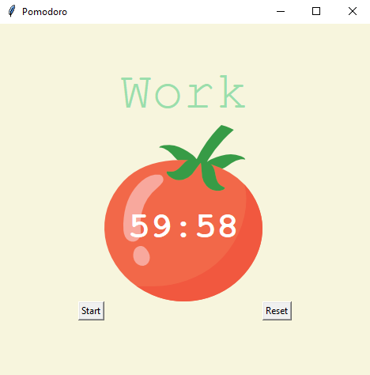

# Pomodoro Timer

The Pomodoro Timer is a time management tool based on the Pomodoro technique, which involves focused work intervals interspersed with regular breaks. This Python application uses the Tkinter graphical interface to create a simple and efficient Pomodoro timer.



## Table of Contents
- [Description](#description)
- [Features](#features)
- [Usage](#usage)
- [License](#license)

## Description

This Pomodoro Timer application provides a simple way to manage time and improve productivity by dividing work into focused intervals followed by regular breaks.

## Features

- Configurable Pomodoro timer, with options for work intervals, short breaks, and long breaks.
- User-friendly graphical interface with start and reset buttons.
- Indicator for the number of completed work sessions.

## Usage

1. **Configuration**: Modify the constants `WORK_MIN`, `SHORT_BREAK_MIN`, and `LONG_BREAK_MIN` in the code to adjust the duration of work sessions and breaks.
2. **Execution**: Run the Python script to start the Pomodoro Timer application.
    ```
    python pomodoro.py
    ```
3. **Usage**: Press the "Start" button to begin a Pomodoro cycle. Press the "Reset" button to reset the timer.
4. **Progress Monitoring**: Check the number of completed work sessions using check marks.

## License

This project is licensed under the [MIT License](LICENSE).
